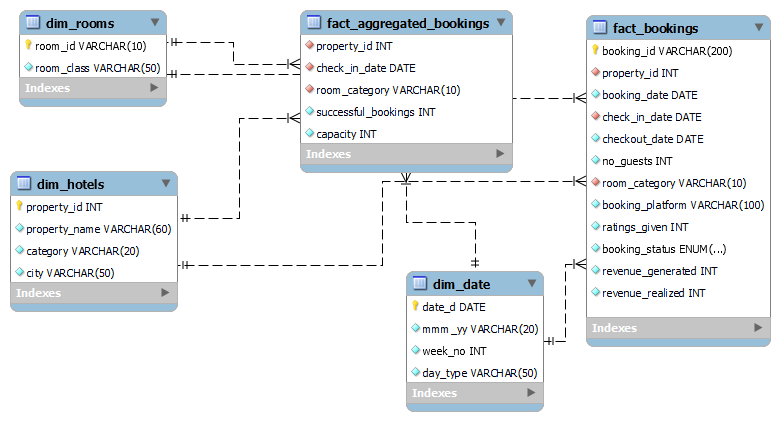

# Hospitality Revenue Optimization

## Table of Contents

- [Project Overview](#project-overview)
- [Data Sources](#data-sources)
- [Tools](#tools)
- [Data Cleaning and Preparation](#data-cleaning-and-preparation)
- [Database & tables creation](#database--tables-creation)
- [Exploratory Data Analysis (EDA)](#exploratory-data-analysis-eda)
- [Interactive dashboard](#interactive-dashboard)
- [Results/Findings](#resultsfindings)
- [Recommendations](#recommendations)

### Project Overview

This project is focused on helping a luxury hotel chain—AtliQ Grands—leverage its historical booking data to make smarter business decisions. 
The goal is to analyze patterns in bookings, room preferences, cancellations, and seasonal trends to uncover insights that can optimize revenue, reduce losses, and 
improve operational efficiency.

### Data Sources

<b>fact_bookings:</b> This table represents detailed information about bookings, property id in which property the booking made, when they booked, check-in and check-out date, no. of guests per booking, room category, in which 
booking platform they booked, how many ratings were given per booking, bookings status whether the booking was checked out, Cancelled or No show, How much revenue generated and
How much revenue was realized after refunds for canceled bookings? <br>
<b>fact_aggregated_bookings:</b> This table represents detailed information about property, check-in date, room category, successful bookings made on that particular check-in date,
How many rooms are available on that day? <br>
<b>dim_rooms:</b> Contains information about room class for a particular room category.<br>
<b>dim_hotels:</b> Contains information about Property name, category, and city for particular Property_id. <br>
<b>dim_date:</b> Contains information about day type, week no., month and year in which month, year, and week no the check-in was done, whether the bookings are in weekdays or weekends. <br>

### Tools

- Excel - Data Cleaning
- Sql - Creating database, tables, data retrieval, and data querying
- Python - Exploratory Data analysis
- Sqlalchemy - Loading SQL data into python
- Pandas - Data manipulation
- Matplotlib & Seaborn - Data visualization
- Scipy - Statistical testing and analysis
- Tableau - Creating interactive dashboard and reports

### Data Cleaning and Preparation

To import tables to the MySQL server, I first cleaned and prepared the data using Excel by performing data type conversions and handling null values, ensuring the dataset was ready for seamless integration into the SQL tables.

### Database & tables creation

After preparing and cleaning the data in Excel by handling null values and converting data types, I created the database and corresponding tables in MySQL. Then, I imported the cleaned data into these tables.<br>



### SQL Querying

Executed SQL queries on the atliq_hospitality database to extract relevant data for exploratory data analysis (EDA) in Python. Here are some Queries.<br>

1. How are bookings distributed among room class?

```
select dr.room_class, count(*) total_bookings
from dim_rooms dr right join fact_bookings fb
on dr.room_id = fb.room_category
group by dr.room_class;
```

2. For canceled bookings, what is the revenue generated and realized for each room class?

```
select dr.room_class, booking_status, revenue_generated, revenue_realized
from
(select * from fact_bookings
where booking_status = 'Cancelled') fb left join dim_rooms dr
on fb.room_category = dr.room_id;
```

3. Do booking platforms impact revenue loss from cancellations?

```
with platform_revenue as (
select booking_platform, booking_status, revenue_generated, revenue_realized
from fact_bookings
)
select * from platform_revenue
where booking_status = 'Cancelled';
```

4. What is the typical stay duration for most bookings?

```
select datediff(checkout_date, check_in_date) stay_duration, 
count(*) total_bookings
from fact_bookings
group by stay_duration
order by stay_duration;
```

5. Are cancellations happening more on weekends or weekdays?

```
select dd.day_type, 
sum(case when fb.booking_status = 'Cancelled' then 1 else 0 end) cancelled_bookings,
sum(case when fb.booking_status != 'Cancelled' then 1 else 0 end) successfull_bookings
from fact_bookings fb left join dim_date dd
on fb.check_in_date = dd.date_d
group by dd.day_type
order by cancelled_bookings desc;
```

6. Do specific weeks have higher or lower successful and cancelled bookings?

```
select dd.week_no, 
sum(case when fb.booking_status = 'Cancelled' then 1 else 0 end) cancelled_bookings,
sum(case when fb.booking_status != 'Cancelled' then 1 else 0 end) successfull_bookings
from fact_bookings fb left join dim_date dd
on fb.check_in_date = dd.date_d
group by dd.week_no
order by cancelled_bookings, successfull_bookings;
```

7. How many successful bookings and capacity in particular check-in date and particular room class?

```
select fa.check_in_date, dr.room_class,
sum(fa.successful_bookings) as total_successful_bookings,
sum(fa.capacity) as total_capacity
from fact_aggregated_bookings fa
left join dim_rooms dr
on fa.room_category = dr.room_id
group by fa.check_in_date, dr.room_class
order by fa.check_in_date;
```

8. What is the revenue generated and realized by booking month?

```
select month(booking_date) booking_month, booking_status, revenue_generated, revenue_realized
from fact_bookings
order by booking_month;
```

9. What is the revenue generated and realized by property city and booking status?

```
select dh.city, fb.booking_status, fb.revenue_generated, fb.revenue_realized
from dim_hotels dh right join fact_bookings fb
on dh.property_id = fb.property_id;
```

10. How many successful bookings and capacity in particular check-in date and particular day type?

```
select fa.check_in_date, dd.day_type,
sum(fa.successful_bookings) as total_successful_bookings,
sum(fa.capacity) as total_capacity
from fact_aggregated_bookings fa
left join dim_date dd
on fa.check_in_date = dd.date_d
group by fa.check_in_date, dd.day_type
order by fa.check_in_date;
```

To view SQL queries, [Click here](https://github.com/Bhuvi128/Hospitality-Revenue-Optimization-Analysis/blob/main/Hospitality%20Revenue%20Analysis.sql)

### Exploratory Data Analysis (EDA)

Performed in-depth exploratory analysis to understand booking behaviors, revenue trends, and cancellation patterns.EDA has been performed on various factors, such as:<br>

- <b>Distribution Analysis of:</b>
  - Revenue generated
  - Revenue (Generated vs. Realized) by cancelled bookings
  - Booking Status (Successful vs. Cancelled)
  - Property Name, City, Category, Room Class, Ratings, Number of Guests, Booking platform, booking month, and stay duration.
  - Successful bookings and cancelled bookings by day type.
  - Successful bookings and cancelled bookings by week no.
  - Successful bookings vs Capacity over time.

- <b>Revenue Relationship:</b>
  - Analyzed the correlation between generated and realized revenue.
  - Analyzed the correlation between generated and realized revenue with various factors like room class, property name, city, category, and booking status.

- <b>Hypothesis Testing:</b>
  - Test the percentage of revenue realized after cancellations using statistical methods.

- <b>Cancellation Patterns:</b>
  - Explored how Cancellations vary across Room Class, Property Name, Category, City, Ratings, Number of Guests, Booking month, Booking Platform, Stay Duration, and Day Type

- <b>Successful bookings vs Capacity Over time</b>
  - Compare successful bookings with capacity using Room Class, Property Name, City, Category, Month with Year, Week No, and Day Type.

### Interactive dashboard

Designed and developed an interactive Tableau dashboard to enable stakeholders to monitor hotel performance trends and metrics over time.

[](https://public.tableau.com/app/profile/bhuvanendiran.s/viz/HospitalityRevenueOptimizationDashboard/HospitalityRevenueOptimizationDashboard)

### Results/Findings

- <b>Booking Behavior</b>
  - The majority of bookings are successfully checked out.
  - Cancellations are frequent; no-shows are minimal.
  - Indicates proactive cancellation behavior by guests.

- <b>Revenue Insights</b>
  - Revenue Generated is skewed with a few high-value bookings.
  - Revenue Realized varies widely due to cancellations and refunds.
  - There is a clear positive correlation between generated and realized revenue.

- <b>Impact of Cancellations</b>
  - Cancelled bookings yield minimal revenue.
  - High-value bookings are more prone to financial loss on cancellation.
  - Suggests need for refined refund policies for premium bookings.

- <b>Refund Consistency</b>
  - Statistical tests confirm a uniform refund pattern (~60% refunded).
  - Indicates a stable and predictable cancellation policy.

- <b>Room Class & Property Performance</b>
  - Elite and Standard rooms are most preferred.
  - Presidential rooms show a high variance in revenue.
  - Luxury properties outperform Business ones in booking volume.
  - Atliq Palace, Atliq Exotica, and Atliq City are top-performing properties.
  - Atliq Seasons is underperforming, indicating potential areas for improvement.

- <b>City-Wise Trends</b>
  - Mumbai dominates in bookings, followed by Hyderabad and Bangalore.
  - Delhi underperforms, pointing to potential strategic gaps.

- <b>Bookings by Day Type (Weekday vs Weekend)</b>
  - Weekdays see higher booking activity — both successful and cancelled.
  - Weekend bookings are fewer but more committed, with lower cancellation rates.
  - Suggests tentative bookings happen on weekdays and leisure/stable bookings on weekends.

- <b>Bookings by Week Number</b>
  - Bookings stay fairly consistent across weeks, except for a dip in Week 32 — could be due to seasonality or data issues.
  - Weeks 27–29 show higher cancellations, possibly due to external factors (e.g., weather, pricing).
 
- <b>Bookings vs Capacity Over Time</b>
  - Capacity is stable, but bookings are consistently below full occupancy.
  - Clear weekly cycles indicate predictable customer behavior.

### Recommendations

To regain its lost market share and revenue in the luxury and business hotel segment, AtliQ Grands should adopt a data-driven, customer-centric strategy that emphasizes flexible pricing, targeted marketing, and operational agility.<br>
The analysis reveals patterns in customer behavior (e.g., weekday bookings with high cancellations, underutilized room types, and regional disparities in performance) that highlight the need for tailored interventions across booking periods, room categories, and locations.<br>

Key areas of focus should include:

- <b>Dynamic Pricing & Promotions:</b> Use demand forecasting to align pricing and offers with booking trends and seasonal patterns.
- <b>Product Repositioning:</b> Rebrand or bundle underperforming room types and properties to better meet customer expectations.
- <b>City-Specific Strategies:</b> Allocate resources based on city-level performance, doubling down on high-performing regions and investigating issues in weaker markets.
- <b>Customer Retention & Personalization:</b> Introduce loyalty programs and personalized marketing to build long-term customer relationships and reduce cancellations.
- <b>Operational Efficiency:</b> Align staffing and capacity with demand to improve profitability during low-traffic periods.
- <b>Refund Policies:</b> Implement Stricter Cancellation policies and reduce the refund percentage to avoid higher revenue loss for cancelled bookings.

By integrating these insights into strategic decision-making, AtliQ Grands can position itself as a forward-thinking, resilient brand in India’s competitive hospitality industry, leading to improved occupancy, revenue, and customer satisfaction.
